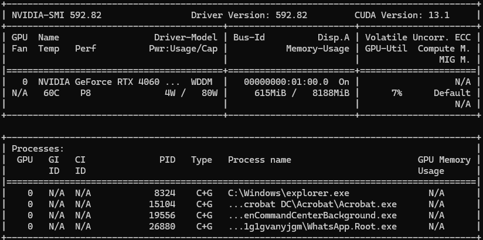

## PyTorch GPU Setup

Installed PyTorch with CUDA 13.0 support using the official PyTorch installation command.

from https://pytorch.org/get-started/locally/ as mine support NVIDIA GPU support so selected 13.0

## TO CHECK NVIDA GPU is there or not from cmd

>nvidia-smi
## for more info 
>nvidia-smi -q 